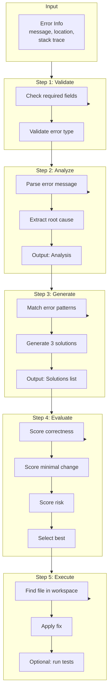

# Detailed Workflow

## Overview

The code-fix workflow is a systematic approach to fixing code errors. It consists of 5 main steps that progress from understanding the error to applying a fix.

## Flow Diagram



## Step Details

### Step 1: Validate

**Purpose**: Ensure error information is complete and valid.

**Implementation**: No separate script. Done by `runner.py` before calling analyze:

- Check errorMessage is present
- Check errorLocation has filePath (optional)
- Validate errorType is recognized

**If validation fails**: Return error and request more information from user.

### Step 2: Analyze

**Purpose**: Understand the root cause of the error.

**Process**:

1. Parse error message for patterns
2. Extract file location from stack trace
3. Match against known error patterns
4. Output root cause and suggested directions

**Output**:

```json
{
  "errorType": "RUNTIME_ERROR",
  "rootCause": "Variable is null when accessed",
  "suggestedDirections": ["Add null check before access"],
  "confidence": 0.85
}
```

### Step 3: Generate Solutions

**Purpose**: Create multiple fix approaches.

**Process**:

1. Match error pattern to fix templates
2. Generate 3 distinct solutions
3. Each solution includes description, fixed code, affected files

**Output**:

```json
{
  "solutions": [
    {
      "solutionId": "solution-1",
      "description": "Add null check",
      "filePath": "src/app.js",
      "fixedCode": "if (value != null) { ... }"
    }
  ]
}
```

### Step 4: Evaluate Solutions

**Purpose**: Score and select the best fix.

**Scoring Criteria**:

- **Correctness** (40%): Does it fix the root cause?
- **Minimal Change** (30%): Is the fix small and focused?
- **Risk** (30%): Low risk of introducing new bugs?

**Output**:

```json
{
  "evaluations": [...],
  "bestSolutionId": "solution-2",
  "bestScores": {
    "correctness": 0.9,
    "minimalChange": 0.8,
    "risk": 0.2,
    "total": 0.82
  }
}
```

### Step 5: Execute

**Purpose**: Apply the fix to the codebase.

**Process**:

1. Locate file in workspace
2. Apply the fix
3. Optionally run tests

**Output**:

```json
{
  "executionStatus": "SUCCESS",
  "modifiedFiles": ["src/app.js"],
  "executionLog": "Applied fix to src/app.js"
}
```

## Error Patterns

| Pattern            | Keywords                              | Typical Fix                |
| ------------------ | ------------------------------------- | -------------------------- |
| Null error         | null, undefined, cannot read          | Add null check             |
| Type error         | type, is not a                        | Add type conversion        |
| Import error       | cannot find, not defined              | Add import                 |
| Test failure       | expected, assertion                   | Fix expectation or code    |
| Not found          | 404, enoent, not found                | Check URL/path             |
| Duplicate variable | duplicate, already defined, redefined | Remove duplicate or rename |

## Usage Examples

### Basic Fix

```bash
python runner.py --error-type RUNTIME_ERROR \
  --error-message "Cannot read property 'map' of undefined" \
  --file src/UserList.js --line 42
```

### Direct Fix (Skip Analysis)

```bash
python runner.py --direct-fix \
  --error-message "Missing semicolon" \
  --file app.js --line 10
```

### With Test Execution

```bash
python runner.py --error-type TEST_FAILURE \
  --error-message "Test failed: expected 5, got 3" \
  --file test/user_test.js --run-test
```

## Integration with Cursor

When used as a Cursor skill:

1. User reports error or test failure
2. Skill extracts error info from context
3. Runs workflow automatically (analyze -> generate -> evaluate)
4. Agent edits workspace files directly based on workflow output (best solution, fixedCode, location)
5. Reports results

**Execution responsibility:**

- **In Cursor**: The Agent directly edits files based on workflow output. The executor script provides suggestions.
- **Via CLI**: Run `python scripts/runner.py` from the skill directory. The executor attempts code replacement or appends suggestions.

No external service or API key required.
