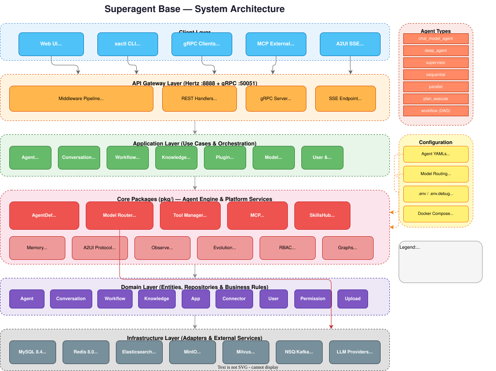

# Superagent Base

**Superagent Base** 是一个开源 AI Agent 开发平台，基于 [Coze Studio](https://github.com/coze-dev/coze-studio) 构建。它为构建、部署和管理 AI Agent 提供完整的后端服务，支持声明式 YAML 定义、多模型路由、工具调用、多 Agent 编排、Workflow 图执行、中断/恢复、A2UI 协议流式输出，以及完整的可观测性栈。

---

## 核心特性

| 能力 | 说明 |
|------|------|
| **声明式 Agent 定义** | 使用 YAML 文件定义 Agent，支持 5 种类型（chat、supervisor、sequential、parallel、workflow），热重载无需重启 |
| **Model Router** | 基于能力、成本、延迟的路由策略 + 自动 fallback |
| **MCP Client + Server** | stdio + SSE 传输，消费外部 MCP 工具并对外暴露平台能力 |
| **Memory 适配器** | 4 种后端：builtin / Mem0 / Zep / Letta |
| **SkillsHub 技能系统** | Local / HTTP / Composite Invoker，内置 datetime / calculator / uuid |
| **Tool 中间件链** | retry / timeout / rate-limit / cache + 内置工具 web_search / http_request / code_execute |
| **多 Agent 编排** | Supervisor / Sequential / Parallel 三种模式 |
| **Workflow / Graph Tool** | DAG 执行，拓扑排序，节点类型：llm_call / agent_call / tool_call / code / condition |
| **Eino Dev 可视化编排** | 通过 VS Code "Eino Dev" 插件图形化编排 Eino Graph，导出原生 Go 代码后注册到 `pkg/graphs/`，YAML 引用即可热加载 |
| **中断/恢复** | 检测确认请求 → 保存 checkpoint → HTTP Resume API 恢复对话 |
| **A2UI 协议** | 结构化流式事件（text / thinking / tool_call / tool_result / code_block / interrupt / error / done / progress / agent_switch） |
| **Experience Self-Evolution** | 本地 MySQL 存储执行经验，自动收集信号 → 基因提炼 → 推荐注入 system prompt，零外部依赖 |
| **OpenTelemetry + Prometheus** | 分布式追踪 + 指标（Agent 请求数/延迟/错误率、Model Token、Tool 调用、活跃会话数、Evolution 信号），Eino callback 自动上报 |
| **Monitor Dashboard** | 4 Tab 实时面板（Status / Metrics / Logs / Admin），纯 SVG 图表，SSE 日志流，热重载管理 |
| **监控栈一键部署** | Prometheus + Grafana + OTel Collector，`docker compose -f docker/docker-compose-monitoring.yml up -d` |
| **Admin API** | `GET /api/v1/admin/status`（运行状态）、`POST /api/v1/admin/reload`（热重载）、`GET /api/v1/admin/logs`（实时日志 SSE）、Evolution 管理 API |
| **gRPC API** | AgentService / ConversationService / ModelService / ToolService |
| **HTTP SSE 流式 API** | POST /api/v1/chat/stream，GET /api/v1/agents，POST /api/v1/chat/resume |
| **前端认证** | API Key 认证门禁，localStorage 持久化，未授权自动跳转登录页 |
| **Agent 编辑器** | Monaco YAML 编辑器 + 表单双向同步，创建 / 编辑 / 复制 / 删除 / 校验 / 测试对话 |
| **Workflow 图编辑器** | React Flow DAG 画布，5 种节点拖放，属性面板，自动布局，YAML ↔ Graph 双向序列化 |
| **Skills 市场** | 搜索 / 安装 / 卸载技能，对接 SkillHub 真实 API |
| **Web UI** | React + Vite + Tailwind，流式对话 + 监控面板 + 技能市场 |
| **Docker Compose + Helm** | 开发环境轻量栈 + 生产级 Kubernetes 部署 |
| **CLI 工具 sactl** | 技能管理和 Agent 管理命令行工具 |

---

## 架构总览

> 完整架构文档：[docs/architecture.md](docs/architecture.md) | 可编辑源文件：[docs/architecture.drawio](docs/architecture.drawio)



---

## 快速开始

### 前置条件

- Go 1.24+
- Docker + Docker Compose
- 本地 LLM：[LM Studio](https://lmstudio.ai/) 监听 `http://127.0.0.1:8000/v1`（或 Ollama / 任意 OpenAI 兼容端点）

### 3 步启动

```bash
# 1. 克隆
git clone <repo-url>
cd superagent-base

# 2. （可选）配置模型：编辑 docker/.env.dev
#    填写 MODEL_API_KEY_0 和 MODEL_BASE_URL_0

# 3. 启动（MySQL + Redis + backend）
make dev
```

访问 `http://localhost:8888`，gRPC 在 `localhost:50051`。

```bash
# 停止
make dev-down
```

---

## API 快速参考

### HTTP SSE 流式 API

| 方法 | 路径 | 说明 |
|------|------|------|
| `POST` | `/api/v1/chat/stream` | 流式对话，支持 Legacy 和 A2UI 两种模式 |
| `GET` | `/api/v1/agents` | 列出所有已加载 Agent |
| `POST` | `/api/v1/chat/resume` | 恢复中断的对话 |
| `GET` | `/api/v1/chat/interrupt_state` | 查询会话中断状态 |

### 监控与管理 API

| 方法 | 路径 | 说明 |
|------|------|------|
| `GET` | `/api/v1/admin/status` | 系统运行状态（uptime、agents、health、ready） |
| `POST` | `/api/v1/admin/reload` | 触发 Agent 热重载 |
| `GET` | `/api/v1/admin/logs` | SSE 实时日志流（结构化 JSON） |
| `GET` | `/api/v1/admin/evolution/stats` | Evolution 引擎状态（基因数、置信度、成功率） |
| `GET` | `/api/v1/admin/evolution/genes` | 基因列表（支持 `?q=&min_confidence=&limit=`） |
| `GET` | `/api/v1/admin/evolution/federated` | 预留（本地模式返回空） |
| `GET` | `/metrics` | Prometheus 指标端点 |
| `GET` | `/health` | 健康检查 |
| `GET` | `/ready` | 就绪检查（含 Agent Runtime 状态） |

**流式对话示例（Legacy 模式）：**

```bash
curl -X POST http://localhost:8888/api/v1/chat/stream \
  -H "Content-Type: application/json" \
  -d '{"agent_id":"research-agent","session_id":"s1","message":"研究一下量子计算"}' \
  --no-buffer
```

**A2UI 模式（结构化事件）：**

```bash
curl -X POST http://localhost:8888/api/v1/chat/stream \
  -H "Content-Type: application/json" \
  -H "X-A2UI: true" \
  -d '{"agent_id":"research-agent","session_id":"s1","message":"研究一下量子计算"}' \
  --no-buffer
```

### 集团小海对接 API（集团IT智能体输出规范 v1.0.0）

| 方法 | 路径 | 说明 |
|------|------|------|
| `POST` | `/api/v1/xiaohai/stream/:agent_id` | 流式 SSE，输出符合集团规范（execution_steps / answer / stream_end） |
| `POST` | `/api/v1/xiaohai/chat/:agent_id` | 非流式 JSON，返回 `{code:0, data:{type,data,version}}` |

**Header**: `Api-Key`（鉴权）、`Access-Token`（用户 token）

**Body 示例**:

```json
{
  "userQuery": "帮我查一下今天的日程",
  "userToken": "user-token",
  "terminalType": "PC",
  "sessionId": "thread-123",
  "hisMsg": [{"human": "你好", "ai": "有什么可以帮您？"}],
  "fileList": [],
  "ext_param": {}
}
```

**流式输出示例**:

```
data: {"type":"execution_steps","data":{"content_type":"markdown","content":"正在调用 http_request ..."},"version":"1.0.0"}
data: {"type":"execution_steps_end","version":"1.0.0"}
data: {"type":"answer","data":{"content_type":"markdown","content":"查询结果如下..."},"version":"1.0.0"}
data: {"type":"stream_end","version":"1.0.0"}
```

### gRPC API

| 服务 | 说明 |
|------|------|
| `AgentService` | Agent 查询、对话、流式聊天 |
| `ConversationService` | 会话创建、历史管理 |
| `ModelService` | 模型列表、路由查询 |
| `ToolService` | 工具列表、调用 |

Proto 文件：`api/proto/`

---

## Agent YAML 快速参考

```yaml
apiVersion: superagent/v1
kind: Agent
metadata:
  name: my-agent          # 唯一标识，匹配 [a-z0-9-]+
  version: "1.0.0"
spec:
  type: chat_model_agent  # chat_model_agent | supervisor | sequential | parallel | workflow
  model:
    primary: gpt-4o       # 主模型 ID
    fallback: deepseek-r1 # 备用模型
    router: capability-based  # 路由策略（可选）
  system_prompt: "你是一个助手..."
  tools:
    - ref: builtin/web_search
    - ref: mcp://my-server/search
    - ref: skill://calculator
  memory:
    backend: builtin      # builtin | mem0 | zep | letta
  interrupt:
    enabled: true
    checkpoint_backend: redis
    timeout_seconds: 300
  evolution:
    enabled: true           # 启用经验自进化
    collect:                # 信号过滤（可选，为空则收集全部）
      - tool_success
      - tool_error
      - model_invoke
  observability:
    tracing: true
    metrics: true
    log_level: info
```

**有效的 `spec.type` 值：**

| 类型 | 说明 |
|------|------|
| `chat_model_agent` | 标准对话 Agent，可挂载工具 |
| `deep_agent` | 深度推理模式，支持多步规划 |
| `supervisor` | 多 Agent 协调者，通过 LLM 决策分发给 sub_agents |
| `sequential` | 顺序执行 sub_agents，前一个输出作为下一个输入 |
| `parallel` | 并发执行所有 sub_agents，合并输出 |
| `plan_execute` | 先规划后执行的多 Agent 模式 |
| `workflow` | DAG 图执行，通过 spec.workflow 定义节点和边 |
| `eino_graph` | 原生 Eino Graph，通过 `pkg/graphs.Register()` 注册编译后的图，无需修改平台代码 |

---

## 内置 Agent 案例（14 个）

开箱即用的 Agent 模板，覆盖典型 AI Agent 场景（参考 [cloudwego/eino-examples](https://github.com/cloudwego/eino-examples)）：

### 基础能力

| Agent | 类型 | 场景 |
|-------|------|------|
| `research-agent` | chat_model_agent | 通用研究助手，清晰简洁地回答问题 |
| `react-tools-agent` | chat_model_agent + 3 tools | ReAct 推理循环，自动调用 web_search / http_request / code_execute |
| `rag-knowledge-agent` | chat_model_agent + search | RAG 知识问答，检索文档后附带引用来源回答 |
| `code-assistant` | agentloop (15 轮) | 自主编程：分析需求 → 编写代码 → 执行验证 → 修复问题 |
| `data-analyst` | chat_model_agent + code_execute | 数据分析：执行 Python 进行统计、处理和可视化 |

### 多 Agent 编排

| Agent | 类型 | 场景 |
|-------|------|------|
| `team-supervisor` | supervisor | 团队协调：分派任务给 researcher / coder / tools 三个子 Agent |
| `project-manager` | supervisor | 项目管理：识别请求并委派给合适的 sub_agent |
| `plan-execute-agent` | plan_execute | 先规划后执行：制定 3-7 步计划，逐步执行，动态调整 |
| `parallel-analysis` | parallel | 并行多视角：同时从事实和技术两个角度分析，综合结论 |
| `sequential-pipeline` | workflow (3 节点) | 顺序流水线：翻译 → 润色 → 校对 三步 DAG |

### 人机协作

| Agent | 类型 | 场景 |
|-------|------|------|
| `approval-agent` | chat_model_agent + interrupt | 安全确认：危险操作前暂停等待用户确认 |
| `approval-workflow` | chat_model_agent + interrupt + tools | 审批工作流：敏感操作（发邮件、付款）自动触发审批门禁 |
| `feedback-writer` | agentloop (8 轮) | 迭代写作：生成 → 等待反馈 → 修改，循环直到满意 |

### 工作流

| Agent | 类型 | 场景 |
|-------|------|------|
| `research-workflow` | workflow (3 节点) | 研究流水线：搜索 → 分析 → 格式化报告 |

> 所有 Agent YAML 定义在 `backend/configs/agents/`，支持 fsnotify 热加载，修改后无需重启。

---

## Make 命令

| 命令 | 说明 |
|------|------|
| `make dev` | 启动 MySQL + Redis + backend（开发推荐） |
| `make dev-middleware` | 仅启动 MySQL + Redis |
| `make dev-server` | 构建并运行 backend（需先启动 middleware） |
| `make dev-down` | 停止 dev 容器 |
| `make dev-clean` | 停止容器并删除 MySQL 数据 |
| `make build` | 构建 `bin/superagent` |
| `make test` | 运行 `pkg/` 测试 |
| `make test-all` | 运行全部测试 |
| `make debug` | 启动完整 debug 环境（含 ES / MinIO / NSQ 等） |

### 监控栈

```bash
# 启动 Prometheus + Grafana + OTel Collector
docker compose -f docker/docker-compose-monitoring.yml up -d

# 访问
# Prometheus: http://localhost:9090
# Grafana:    http://localhost:3001 (admin/admin)
# OTel gRPC:  localhost:4317

# 启动后端时开启 OTel 追踪
export OTEL_ENABLED=true
export OTEL_ENDPOINT=localhost:4317
export SERVICE_NAME=superagent
make dev-server
```

**可观测性指标**:

| 指标 | 说明 |
|------|------|
| `superagent_agent_requests_total{agent_id, status}` | Agent 请求计数（区分 legacy/a2ui 模式） |
| `superagent_agent_request_duration_seconds{agent_id}` | 请求延迟直方图 |
| `superagent_active_sessions` | 当前并发会话数 |
| `superagent_model_tokens_total{model_id, provider, type}` | Model Token 消耗 |
| `superagent_model_errors_total{model_id, provider, error_type}` | Model 调用错误 |
| `superagent_tool_invocations_total{tool_name, status}` | Tool 调用计数 |
| `superagent_agent_reload_failures_total{agent_id}` | 热重载失败计数 |
| `evolution_signals_total{signal_type}` | Evolution 信号收集计数 |
| `evolution_genes_shared_total` | 基因写入成功计数 |
| `evolution_share_failed_total` | 基因写入失败计数 |
| `evolution_share_dropped_total` | 信号丢弃计数（背压保护） |
| `evolution_recommendations_served_total` | 基因推荐服务计数 |

---

## Experience Self-Evolution

Superagent Base 内置**经验自进化**能力——自动收集执行信号，提炼为"基因"（Gene）存储在本地 MySQL，并在后续对话中推荐最优策略注入 system prompt。零外部依赖，只需已有的 MySQL。

### 信号流

```
Agent 执行 → Eino Callback → SignalCollector.Collect() → [bounded goroutine pool]
    → LocalGeneStore.SaveGene() → MySQL (evolution_genes 表)
```

### 推荐流

```
AgentBuilder.Build() → EvolutionAdvisor.Recommend(query)
    → LocalGeneStore.Search() → Gene 列表
    → 注入 system prompt 前缀（最优策略建议）
```

### 环境变量

| 变量 | 说明 | 默认值 |
|------|------|--------|
| `EVOLUTION_ENABLED` | 启用经验自进化 | `false` |
| `EVOLUTION_SENDER_ID` | 本节点 ID | `superagent-node-1` |
| `EVOLUTION_MIN_CONFIDENCE` | 推荐最低置信度 | `0.5` |
| `EVOLUTION_MAX_SUGGESTIONS` | 最大推荐数 | `3` |

### 快速启用

```bash
# .env 追加
EVOLUTION_ENABLED=true

# 启动后，执行对话即开始收集信号
# 访问 http://localhost:3000/evolution 查看基因库
```

---

## Eino Dev 可视化图编排

> 通过 VS Code **Eino Dev** 插件图形化设计 Eino Graph，将生成的原生 Go 代码直接接入 superagent 热加载体系。

### 工作流程

```
Eino Dev IDE 编排  →  导出 Go 代码  →  放入 pkg/graphs/  →  注册  →  YAML 引用
```

**1. 安装插件**：在 VS Code 中安装 "Eino Dev" 扩展（需 VS Code 1.97+），启动后端后插件自动连接 `127.0.0.1:52538`。

**2. 设计并导出图代码**，放入 `backend/pkg/graphs/my_flow.go`：

```go
package graphs

import (
    "context"
    "github.com/cloudwego/eino/compose"
    "github.com/cloudwego/eino/schema"
)

// BuildMyFlow — generated by Eino Dev
func BuildMyFlow(ctx context.Context) (*compose.Graph[[]*schema.Message, *schema.Message], error) {
    g := compose.NewGraph[[]*schema.Message, *schema.Message]()
    // ... nodes and edges ...
    return g, nil
}

func init() {
    Register("my-flow", CompileGraph(BuildMyFlow))
}
```

**3. 在 YAML 中引用**（`configs/agents/my-flow.yaml`）：

```yaml
apiVersion: superagent/v1
kind: Agent
metadata:
  name: my-flow
spec:
  type: eino_graph
  graph: my-flow          # 对应 Register() 的名字
  system_prompt: "你是一个专业助手。"
```

**4. 热加载规则**：

| 变更类型 | 生效方式 | 耗时 |
|----------|----------|------|
| Go 图代码（`pkg/graphs/*.go`） | `make dev-server` 重启 | ~3s |
| YAML（`configs/agents/*.yaml`） | fsnotify 自动热加载 | 即时 |

---

## Web UI 功能

访问 `http://localhost:3000`（开发模式）或 `http://localhost:8888`（生产构建）。

| 页面 | 路径 | 功能 |
|------|------|------|
| 登录 | `/login` | API Key 认证（开发模式可留空） |
| Agent 管理 | `/agents` | 列表、创建、编辑、复制、删除 |
| Agent 编辑器 | `/agents/:name/edit` | Monaco YAML + 表单双向同步 + 内嵌测试对话 |
| Workflow 编辑器 | `/agents/:name/workflow` | React Flow DAG 画布，拖放节点，自动布局 |
| 对话 | `/chat` | 流式对话，Agent 切换，多轮记忆 |
| 监控 | `/monitor` | 系统状态、Prometheus 指标、实时日志、热重载管理 |
| Skills | `/skills` | 搜索、安装、卸载技能 |
| Evolution | `/evolution` | 经验自进化管理（概览 / 基因库） |
| 设置 | `/settings` | 模型增删、MCP Server 管理 |

---

## 文档

| 文档 | 说明 |
|------|------|
| [docs/agent-yaml-spec.md](docs/agent-yaml-spec.md) | Agent YAML 完整规范：所有类型、所有字段、完整示例 |
| [docs/architecture.md](docs/architecture.md) | 系统架构、数据流、模块依赖 |
| [docs/model-config.md](docs/model-config.md) | 模型配置：LM Studio / Ollama / OpenAI / DeepSeek / Claude 等 |
| [docs/deployment.md](docs/deployment.md) | 部署指南：本地开发 / Docker Compose / Kubernetes Helm |
| [docs/a2ui-protocol.md](docs/a2ui-protocol.md) | A2UI 协议：事件类型、SSE 格式、客户端集成 |
| [docs/interrupt-resume.md](docs/interrupt-resume.md) | 中断/恢复：工作原理、YAML 配置、HTTP API |
| [docs/workflow-guide.md](docs/workflow-guide.md) | Workflow 图执行：节点类型、边定义、变量映射 |
| [docs/skill-development.md](docs/skill-development.md) | 技能开发：内置技能、自定义技能、HTTP 技能托管 |

---

## 目录结构

```
superagent-base/
├── backend/                  Go 后端
│   ├── api/                  HTTP 路由 + gRPC 处理器
│   │   └── handler/coze/     chat_sse.go（SSE 端点）
│   ├── application/          应用服务编排层
│   ├── crossdomain/          跨域服务接口
│   ├── domain/               核心领域逻辑
│   ├── infra/                基础设施适配器
│   └── pkg/
│       ├── agentdef/         Agent YAML 运行时（schema/parser/builder/runtime/interrupt/workflow/orchestration）
│       ├── graphs/           Eino Dev 图注册表 — 放入生成的图代码并 Register()（Coming Soon）
│       ├── a2ui/             A2UI 协议（event.go + encoder.go）
│       ├── evolution/        Experience Self-Evolution（本地 MySQL：Signal 收集 / Advisor 推荐 / Gene Store）
│       ├── modelrouter/      Model Router（路由策略 + fallback）
│       ├── mcp/              MCP Client（stdio/SSE）+ Server
│       ├── memory/           记忆后端适配器
│       ├── skill/            SkillsHub（invoker + manager + builtin）
│       └── tool/             工具中间件链 + 内置工具
├── configs/
│   ├── agents/               Agent YAML 示例（research-agent.yaml 等）
│   └── models/               模型配置 YAML
├── docker/
│   ├── docker-compose-dev.yml     轻量级开发栈（MySQL + Redis）
│   ├── docker-compose-debug.yml   完整 debug 栈
│   ├── docker-compose-monitoring.yml  监控栈（Prometheus + Grafana + OTel）
│   ├── monitoring/                监控配置（prometheus.yml / otel-collector.yaml / grafana）
│   └── .env.dev                   开发环境配置模板
├── web/                      React 前端
│   └── src/
│       ├── pages/            页面组件（Agent 编辑器、Workflow 编辑器、Chat 等）
│       ├── components/       UI 组件 + Agent/Workflow 专用组件
│       ├── lib/              API 客户端、认证、序列化器、工具函数
│       └── test/             Vitest 测试（31 个基线用例）
├── helm/                     Kubernetes Helm Chart
├── api/proto/                gRPC Proto 定义
├── scripts/                  开发脚本（dev-start.sh / e2e-test.sh）
└── Makefile
```

---

## 技术栈

| 组件 | 选型 |
|------|------|
| HTTP 框架 | [Hertz](https://github.com/cloudwego/hertz) (CloudWeGo) |
| LLM SDK | [Eino](https://github.com/cloudwego/eino) (CloudWeGo) |
| Evolution Store | 本地 MySQL (GORM AutoMigrate, evolution_genes 表) |
| LLM Provider | OpenAI / Claude / Gemini / DeepSeek / Ark / Ollama / Qwen |
| gRPC | google.golang.org/grpc |
| ORM | GORM + MySQL 8.x |
| 缓存 | Redis 7 |
| 对象存储 | MinIO（开发）/ TOS / S3（生产） |
| 消息队列 | NSQ（默认）/ Kafka / RabbitMQ |
| 文件监听 | fsnotify（Agent YAML 热重载） |
| 可观测性 | OpenTelemetry + Prometheus |
| Web UI | React + TypeScript + Vite + Tailwind |

---

## License

Apache 2.0 — 详见 [LICENSE-APACHE](LICENSE-APACHE)。

## 致谢

本项目基于 [Coze Studio](https://github.com/coze-dev/coze-studio)（coze-dev Authors，Apache 2.0 许可）构建。
